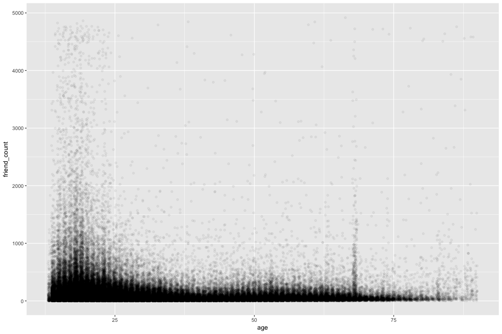
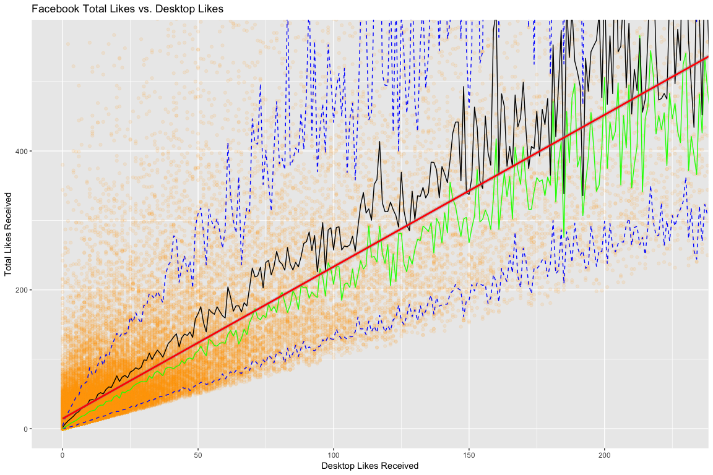

Lesson 8: Explore One Variable
================
Josh Goldberg
October 15, 2017

### Scatterplots and Perceived Audience Size

Notes:

------------------------------------------------------------------------

### Scatterplots

Notes:

``` r
library(rmarkdown)
library(ggplot2)
library(readr)
pf <- read_tsv("pseudo_facebook.tsv")

qplot(x = age, y = friend_count, data = pf)
```


``` r
qplot(age, friend_count, data = pf)
```


------------------------------------------------------------------------

#### What are some things that you notice right away?

Response: Positively skewed; trimodal?

------------------------------------------------------------------------

### ggplot Syntax

Notes:

``` r
ggplot(aes(x = age, y = friend_count), data = pf) +
  geom_point()+
  xlim(13, 90)
```


``` r
summary(pf$age)
```

    ##    Min. 1st Qu.  Median    Mean 3rd Qu.    Max. 
    ##   13.00   20.00   28.00   37.28   50.00  113.00

------------------------------------------------------------------------

### Overplotting

Notes:

``` r
ggplot(aes(x = age, y = friend_count), data = pf) +
  geom_jitter(alpha = 1/20) +
  xlim(13, 90)
```



#### What do you notice in the plot?

Response: Similar properties as before, long tail. So friend count is steady at a certain age, say 30?

------------------------------------------------------------------------

### Coord\_trans()

Notes:

``` r
ggplot(aes(x = age, y = friend_count), data = pf) +
  geom_point(alpha = 1/20) +
  xlim(13, 90) +
  coord_trans(y = 'sqrt')
```

-1.png)

#### Look up the documentation for coord\_trans() and add a layer to the plot that transforms friend\_count using the square root function. Create your plot!

``` r
ggplot(aes(x = age, y = friend_count), data = pf) +
  geom_point(alpha = 1/20, position = position_jitter(h = 0)) +
  xlim(13, 90) +
  coord_trans(y = 'sqrt')
```


#### What do you notice?

------------------------------------------------------------------------

### Alpha and Jitter

Notes:

``` r
ggplot(aes(x = age, y = friendships_initiated), data = pf) +
  geom_point(alpha = 1/10, position = position_jitter(h = 0)) +
  xlim(13, 90) +
  coord_trans(y = 'sqrt')
```


------------------------------------------------------------------------

### Overplotting and Domain Knowledge

Notes:

------------------------------------------------------------------------

### Conditional Means

Notes:

``` r
library('dplyr')

#age_groups <- group_by(pf, age)
#pf.fc_by_age <- summarise(age_groups,
#                          friend_count_mean = mean(friend_count),
#                          friend_count_median = median(friend_count),
#                          n = n())
#pf.fc_by_age <- arrange(pf.fc_by_age, age)
#head(pf.fc_by_age)

pf.fc_by_age <- pf %>%
  group_by(age) %>%
  summarise(friend_count_mean = mean(friend_count),
            friend_count_median = median(friend_count),
            n = n()) %>%
  arrange(age)

head(pf.fc_by_age)
```

    ## # A tibble: 6 x 4
    ##     age friend_count_mean friend_count_median     n
    ##   <int>             <dbl>               <dbl> <int>
    ## 1    13          164.7500                74.0   484
    ## 2    14          251.3901               132.0  1925
    ## 3    15          347.6921               161.0  2618
    ## 4    16          351.9371               171.5  3086
    ## 5    17          350.3006               156.0  3283
    ## 6    18          331.1663               162.0  5196

Create your plot!

``` r
ggplot(aes(x = age, y = friend_count_mean), data = pf.fc_by_age) +
  geom_line() +
  xlab("Age of User") +
  ylab("Average Friend Count") +
  ggtitle("Facebook Average Friend Count vs. Age")
```


------------------------------------------------------------------------

### Overlaying Summaries with Raw Data

Notes: Can't use coord cartesian with coord trans.

``` r
ggplot(aes(x = age, y = friend_count), data = pf) +
  coord_cartesian(xlim = c(13, 90), ylim = c(0, 1000)) +
  xlab("Age of User") +
  ylab("Friend Count") +
  ggtitle("Facebook Friend Count vs. Age") +
  geom_point(alpha = 0.05,
             position = position_jitter(h = 0),
             color = 'orange') +
  #coord_trans(y = 'sqrt') + 
  geom_line(stat = 'summary', fun.y = mean) +
  geom_line(stat = 'summary', fun.y = quantile,
            fun.args = list(probs = .1), linetype = 2, color = 'blue') +
  geom_line(stat = 'summary', fun.y = quantile,
            fun.args = list(probs = .9), linetype = 2, color = 'blue') + 
  geom_line(stat = 'summary', fun.y = quantile,
            fun.args = list(probs = .5), color = 'blue')
```


#### What are some of your observations of the plot?

Response: 10th quartile does not have as much jumpiness as the other measurements. Mean is skewed positvely by the peaks in the data. Most users on average are below 1,000 friends.

------------------------------------------------------------------------

### Moira: Histogram Summary and Scatterplot

See the Instructor Notes of this video to download Moira's paper on perceived audience size and to see the final plot.

Notes:

------------------------------------------------------------------------

### Correlation

Notes:

``` r
cor.test(pf$age, pf$friend_count, method = 'pearson')
```

    ## 
    ##  Pearson's product-moment correlation
    ## 
    ## data:  pf$age and pf$friend_count
    ## t = -8.6268, df = 99001, p-value < 2.2e-16
    ## alternative hypothesis: true correlation is not equal to 0
    ## 95 percent confidence interval:
    ##  -0.03363072 -0.02118189
    ## sample estimates:
    ##         cor 
    ## -0.02740737

Look up the documentation for the cor.test function.

What's the correlation between age and friend count? Round to three decimal places. Response: -0.027

------------------------------------------------------------------------

### Correlation on Subsets

Notes: Different results when you subset the data to excluded certain data.

``` r
with(subset(pf, age <= 70), cor.test(age, friend_count, method = 'pearson'))
```

    ## 
    ##  Pearson's product-moment correlation
    ## 
    ## data:  age and friend_count
    ## t = -52.592, df = 91029, p-value < 2.2e-16
    ## alternative hypothesis: true correlation is not equal to 0
    ## 95 percent confidence interval:
    ##  -0.1780220 -0.1654129
    ## sample estimates:
    ##        cor 
    ## -0.1717245

------------------------------------------------------------------------

### Correlation Methods

Notes:

------------------------------------------------------------------------

Create Scatterplots
-------------------

Notes:

``` r
library(hexbin)
ggplot(aes(x = www_likes_received, y = likes_received), data = pf) +
  xlab("Desktop Likes Received") +
  ylab("Total Likes Received") +
  ggtitle("Facebook Total Likes vs. Desktop Likes") +
  geom_point(alpha = .1, color = 'orange') +
  coord_cartesian(xlim = c(0, quantile(pf$www_likes_received, 0.95)), 
                  ylim = c(0, quantile(pf$likes_received, 0.95))) +
  geom_line(stat = 'summary', fun.y = quantile, 
            fun.args = list(probs = 0.1), linetype = 2, color = 'blue') +
  geom_line(stat = 'summary', fun.y = quantile,
            fun.args = list(probs = 0.9), linetype = 2, color = 'blue') +
  geom_line(stat = 'summary', fun.y = quantile,
            fun.args = list(probs = 0.5), color = 'green') +
  geom_line(stat = 'summary', fun.y = mean) +
  geom_smooth(method = 'lm', color = 'red')
```



``` r
summary(pf)
```

    ##      userid             age            dob_day         dob_year   
    ##  Min.   :1000008   Min.   : 13.00   Min.   : 1.00   Min.   :1900  
    ##  1st Qu.:1298806   1st Qu.: 20.00   1st Qu.: 7.00   1st Qu.:1963  
    ##  Median :1596148   Median : 28.00   Median :14.00   Median :1985  
    ##  Mean   :1597045   Mean   : 37.28   Mean   :14.53   Mean   :1976  
    ##  3rd Qu.:1895744   3rd Qu.: 50.00   3rd Qu.:22.00   3rd Qu.:1993  
    ##  Max.   :2193542   Max.   :113.00   Max.   :31.00   Max.   :2000  
    ##                                                                   
    ##    dob_month         gender              tenure        friend_count   
    ##  Min.   : 1.000   Length:99003       Min.   :   0.0   Min.   :   0.0  
    ##  1st Qu.: 3.000   Class :character   1st Qu.: 226.0   1st Qu.:  31.0  
    ##  Median : 6.000   Mode  :character   Median : 412.0   Median :  82.0  
    ##  Mean   : 6.283                      Mean   : 537.9   Mean   : 196.4  
    ##  3rd Qu.: 9.000                      3rd Qu.: 675.0   3rd Qu.: 206.0  
    ##  Max.   :12.000                      Max.   :3139.0   Max.   :4923.0  
    ##                                      NA's   :2                        
    ##  friendships_initiated     likes         likes_received    
    ##  Min.   :   0.0        Min.   :    0.0   Min.   :     0.0  
    ##  1st Qu.:  17.0        1st Qu.:    1.0   1st Qu.:     1.0  
    ##  Median :  46.0        Median :   11.0   Median :     8.0  
    ##  Mean   : 107.5        Mean   :  156.1   Mean   :   142.7  
    ##  3rd Qu.: 117.0        3rd Qu.:   81.0   3rd Qu.:    59.0  
    ##  Max.   :4144.0        Max.   :25111.0   Max.   :261197.0  
    ##                                                            
    ##   mobile_likes     mobile_likes_received   www_likes       
    ##  Min.   :    0.0   Min.   :     0.00     Min.   :    0.00  
    ##  1st Qu.:    0.0   1st Qu.:     0.00     1st Qu.:    0.00  
    ##  Median :    4.0   Median :     4.00     Median :    0.00  
    ##  Mean   :  106.1   Mean   :    84.12     Mean   :   49.96  
    ##  3rd Qu.:   46.0   3rd Qu.:    33.00     3rd Qu.:    7.00  
    ##  Max.   :25111.0   Max.   :138561.00     Max.   :14865.00  
    ##                                                            
    ##  www_likes_received 
    ##  Min.   :     0.00  
    ##  1st Qu.:     0.00  
    ##  Median :     2.00  
    ##  Mean   :    58.57  
    ##  3rd Qu.:    20.00  
    ##  Max.   :129953.00  
    ## 

------------------------------------------------------------------------

### Strong Correlations

Notes:

``` r
with(pf, cor.test(likes_received, pf$www_likes_received, method = 'pearson'))
```

    ## 
    ##  Pearson's product-moment correlation
    ## 
    ## data:  likes_received and pf$www_likes_received
    ## t = 937.1, df = 99001, p-value < 2.2e-16
    ## alternative hypothesis: true correlation is not equal to 0
    ## 95 percent confidence interval:
    ##  0.9473553 0.9486176
    ## sample estimates:
    ##       cor 
    ## 0.9479902

What's the correlation betwen the two variables? Include the top 5% of values for the variable in the calculation and round to 3 decimal places.

``` r
with(pf, cor.test(likes_received, pf$www_likes_received, method = 'pearson'))
```

    ## 
    ##  Pearson's product-moment correlation
    ## 
    ## data:  likes_received and pf$www_likes_received
    ## t = 937.1, df = 99001, p-value < 2.2e-16
    ## alternative hypothesis: true correlation is not equal to 0
    ## 95 percent confidence interval:
    ##  0.9473553 0.9486176
    ## sample estimates:
    ##       cor 
    ## 0.9479902

Response:

------------------------------------------------------------------------

### Moira on Correlation

Notes:

------------------------------------------------------------------------

### More Caution with Correlation

Notes:

``` r
library(alr3)
```

Create your plot!

``` r
data(Mitchell)

ggplot(aes(x = Month, y = Temp), data = Mitchell) +
  geom_point()
```


------------------------------------------------------------------------

### Noisy Scatterplots

1.  Take a guess for the correlation coefficient for the scatterplot. Basically zero.

2.  What is the actual correlation of the two variables? 0.05747063

(Round to the thousandths place)

``` r
cor.test(Mitchell$Month, Mitchell$Temp)
```

    ## 
    ##  Pearson's product-moment correlation
    ## 
    ## data:  Mitchell$Month and Mitchell$Temp
    ## t = 0.81816, df = 202, p-value = 0.4142
    ## alternative hypothesis: true correlation is not equal to 0
    ## 95 percent confidence interval:
    ##  -0.08053637  0.19331562
    ## sample estimates:
    ##        cor 
    ## 0.05747063

------------------------------------------------------------------------

### Making Sense of Data

Notes:

``` r
ggplot(aes(x = Month, y = Temp), data = Mitchell) +
  geom_point() +
  scale_x_continuous(lim = c(0, 203), breaks = seq(0, 203, 12))
```


------------------------------------------------------------------------

### A New Perspective

``` r
ggplot(aes(x = (Month %% 12), y = Temp), data = Mitchell)+
  geom_point() +
  scale_x_continuous(lim = c(0, 12), breaks = seq(0, 12, 1))
```

 What do you notice? Response: Cyclical patterns are apparent when the graph is stretched out.

Watch the solution video and check out the Instructor Notes! Notes:

------------------------------------------------------------------------

### Understanding Noise: Age to Age Months

Notes:

``` r
ggplot(aes(x = age, y = friend_count_mean), data = pf.fc_by_age) +
  geom_line() +
  xlab("Age of User") +
  ylab("Average Friend Count") +
  ggtitle("Facebook Average Friend Count vs. Age")
```


------------------------------------------------------------------------

### Create an age\_with\_months variable

``` r
pf$age_with_months <- with(pf, age + (1 - dob_month / 12))
```

### Age with Months Means

``` r
pf.fc_by_age_months <- pf %>%
  group_by(age_with_months) %>%
  summarise(friend_count_mean = mean(friend_count),
            friend_count_median = median(friend_count),
            n = n()) %>%
  arrange(age_with_months)
head(pf.fc_by_age_months)
```

    ## # A tibble: 6 x 4
    ##   age_with_months friend_count_mean friend_count_median     n
    ##             <dbl>             <dbl>               <dbl> <int>
    ## 1        13.16667          46.33333                30.5     6
    ## 2        13.25000         115.07143                23.5    14
    ## 3        13.33333         136.20000                44.0    25
    ## 4        13.41667         164.24242                72.0    33
    ## 5        13.50000         131.17778                66.0    45
    ## 6        13.58333         156.81481                64.0    54

``` r
summary(pf.fc_by_age_months)
```

    ##  age_with_months  friend_count_mean friend_count_median       n         
    ##  Min.   : 13.17   Min.   :  19.75   Min.   :   9.0      Min.   :  1.00  
    ##  1st Qu.: 38.02   1st Qu.:  98.10   1st Qu.:  53.0      1st Qu.: 11.00  
    ##  Median : 62.88   Median : 135.02   Median :  69.0      Median : 64.00  
    ##  Mean   : 62.92   Mean   : 212.95   Mean   : 120.3      Mean   : 82.92  
    ##  3rd Qu.: 87.73   3rd Qu.: 279.78   3rd Qu.: 149.9      3rd Qu.: 96.00  
    ##  Max.   :113.92   Max.   :1621.00   Max.   :1621.0      Max.   :913.00

------------------------------------------------------------------------

### Noise in Conditional Means

``` r
# Create a new line plot showing friend_count_mean versus the new variable,
# age_with_months. Be sure to use the correct data frame (the one you created
# in the last exercise) AND subset the data to investigate users with ages less
# than 71.

ggplot(aes(x = age_with_months, y = friend_count_mean), 
       data = subset(pf.fc_by_age_months, age_with_months < 71)) +
  xlab("User Age by Month Fraction") +
  ylab("Mean Friend Count") +
  ggtitle("Facebook Average Friend Count vs. Age with Month Fraction") +
  geom_line(size = .25) +
  geom_smooth()
```


------------------------------------------------------------------------

### Smoothing Conditional Means

Notes:

``` r
p1 <- ggplot(aes(x = age_with_months, y = friend_count_mean), 
       data = subset(pf.fc_by_age_months, age_with_months < 71)) +
  xlab("User Age by Month Fraction") +
  ylab("Mean Friend Count") +
  ggtitle("Facebook Average Friend Count vs. Age with Month Fraction") +
  geom_line(size = .25) +
  geom_smooth()

p2 <- ggplot(aes(x = age, y = friend_count_mean), 
             data = subset(pf.fc_by_age, age < 71)) +
  geom_line() +
  geom_smooth() +
  xlab("Age of User") +
  ylab("Average Friend Count") +
  ggtitle("Facebook Average Friend Count vs. Age")

p3 <- ggplot(aes(x = round(age / 5) * 5, y = friend_count), 
             data = subset(pf, age < 71)) +
  geom_line(stat = "summary", fun.y = mean) +
  xlab("Age of User with 5 Year Bins") +
  ylab("Average Friend Count") +
  ggtitle("Facebook Average Friend Count vs. Age")

library(gridExtra)

grid.arrange(p1, p2, p3, ncol = 1)
```


------------------------------------------------------------------------

### Which Plot to Choose?

Notes: Probably the middle plot. It seems the middle of tradeoff between flexibility and insights. You don't to pick plots actually. In data analysis, you summarize the same data in different ways to glean numerous insights. Iterative plots may reveal different things about the same data.

------------------------------------------------------------------------

### Analyzing Two Variables

Reflection: Explore data with an open mind. Adjust perceptions to glean different insights. Figure out which insights convey the story of purposeful analysis. Specifically to R, ggplot is a useful tool to quickly build these visualizations through coord cartesian zoom adjustments, as well as data and scale transformations (log, sqrt, etc.). Displaying summary values graphic are also handy and easily accessible with ggplot.

------------------------------------------------------------------------
